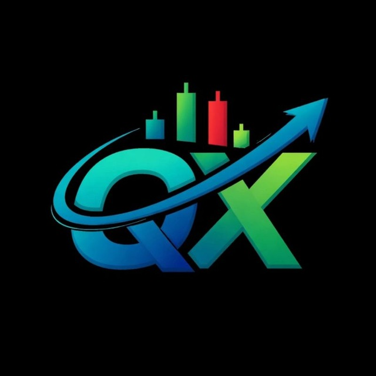
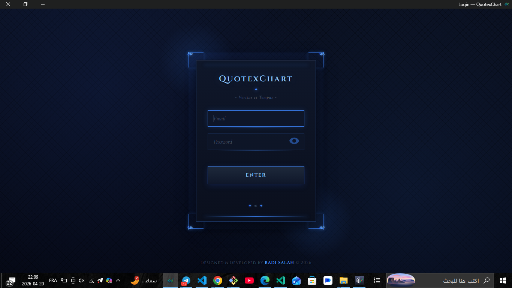
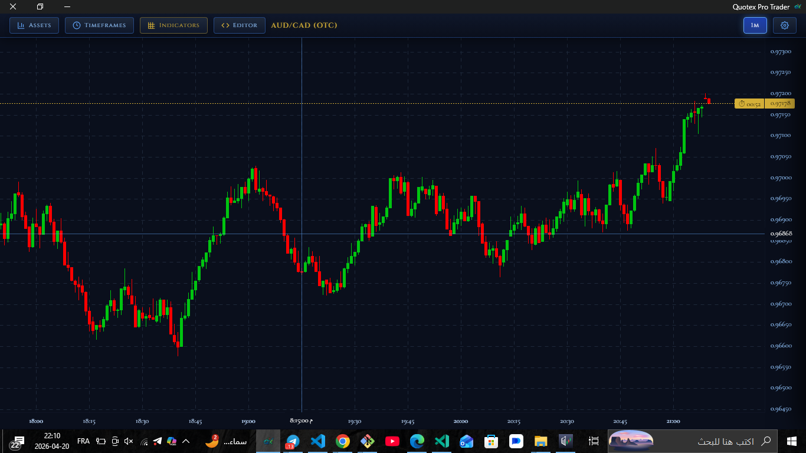
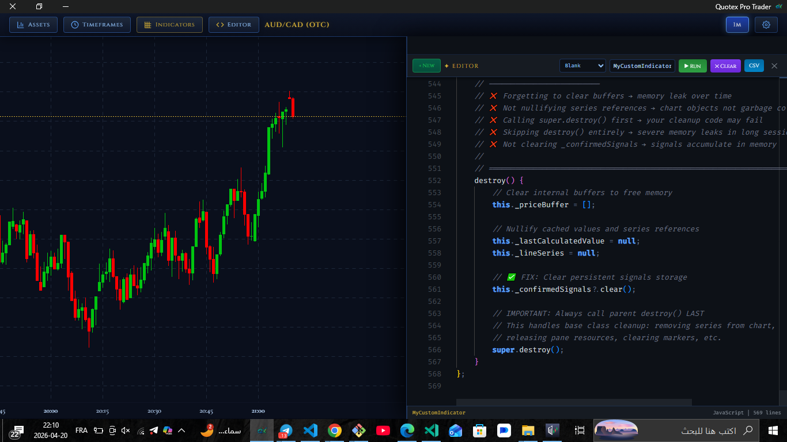
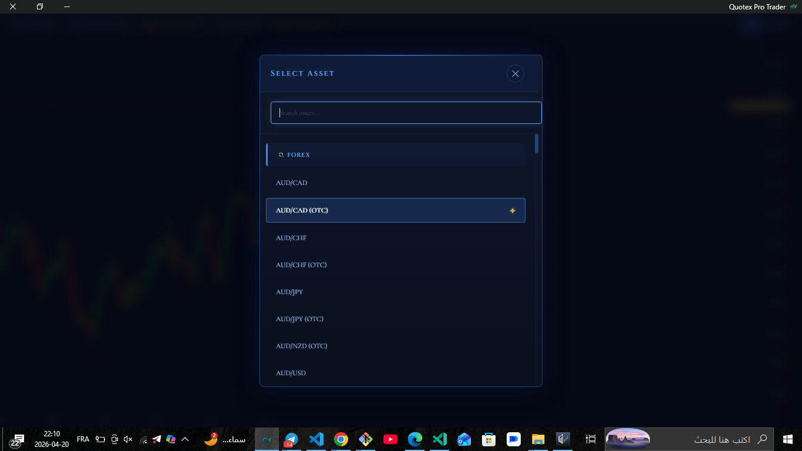
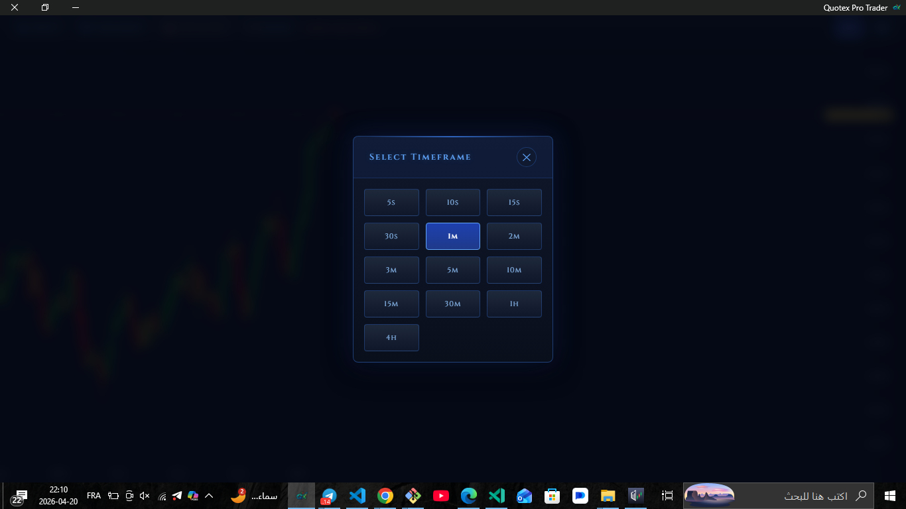
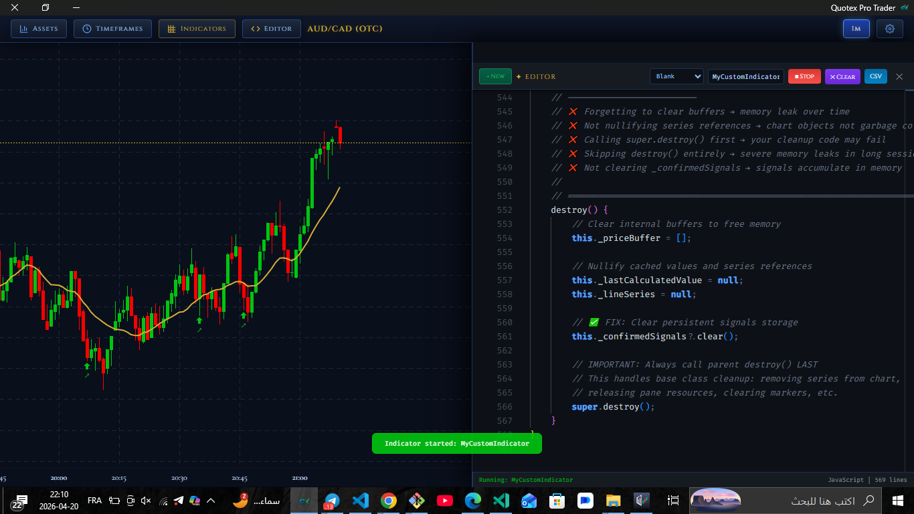

# 🚀 QuotexChart

---

<p align="center">
  
</p>

<p align="center">
  <b>Modern trading interface with real-time charts, indicators, and an advanced editor system.</b>
</p>

<p align="center">
  
  
  
</p>

---

## 🚀 Overview

A lightweight and fast trading UI system inspired by modern trading platforms.
It provides real-time charts, asset selection, timeframe control, and a built-in indicator editor.

📢 Join our Telegram channel for updates and ready-to-use indicators:
👉 https://t.me/qxchart

---

# 🛠️ Installation & Usage

```bash
# Clone the repository
git clone https://github.com/salahbadi19/QuotexChart.git
cd QuotexChart

# Install requirements
pip install -r requirements.txt

# Run the application
python engine.py
```

---

# 🧭 Trading Dashboard Preview

<p align="center">
  
  
  
</p>

<p align="center">
  <i>Login • Chart Engine • Indicator Editor</i>
</p>

---

# 📊 Market Tools

<p align="center">
  
  
</p>

<p align="center">
  <i>Asset Selection • Timeframe Control</i>
</p>

---

# ⚙️ Indicator Engine

<p align="center">
  
</p>

<p align="center">
  <i>Run custom indicators directly from the built-in editor</i>
</p>

---

# ⚡ Key Features

- 📈 Real-time candlestick chart engine
- 💱 Multi-asset trading interface
- ⏱️ Dynamic timeframe switching
- 🧑‍💻 Built-in indicator editor
- ⚙️ Live script execution engine
- ⚡ Optimized high-performance UI

---

# 🧠 System Design

- Modular UI component architecture
- Event-driven updates system
- Plugin-based indicator engine
- Optimized rendering pipeline
- Scalable structure for future expansion

---

# 🤝 Credits

- Core inspiration: 🔗 https://github.com/cleitonleonel/pyquotex
- Official Repository: 🔗 https://github.com/salahbadi19/QuotexChart
- Project author: @qxzero1

---

# 📢 Community

Stay updated & get indicators:
👉 https://t.me/qxchart

---

# 📜 License

MIT License — free to use, modify, and distribute.
